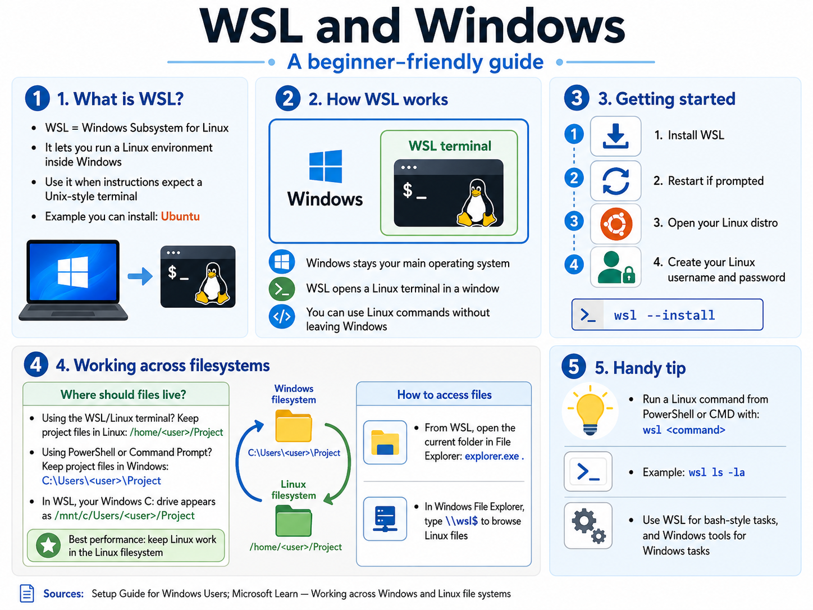

# Setup Guide for Windows Users

Several questions in this assessment expect a **Unix-style terminal** (bash or zsh). On Windows, that means using **WSL (Windows Subsystem for Linux)**, not PowerShell or Command Prompt.

If you have never heard of WSL, that is completely fine. WSL is a Microsoft-supported feature that lets you run Ubuntu Linux inside Windows, in its own terminal window. Most people install it in about 15 to 30 minutes.

> We recommend **Windows 11** to get the latest updates and the smoothest WSL experience. If you prefer not to use Windows, you can switch to a free Linux OS such as Ubuntu.

**Prefer to install Linux directly instead of using WSL?** That works too, and is fully supported for this course. Ubuntu is the most beginner-friendly distribution and is the same Linux that WSL would install for you anyway. You can install Ubuntu alongside Windows (dual-boot), on a spare laptop, or try it from a USB stick first without committing. See the [Linux install path for Windows users](#linux-install-path-for-windows-users) section at the bottom of this file. Once Ubuntu is running, you can skip the WSL steps entirely; the rest of this section does not apply to you.

You do not need WSL to read the questions, but you might need it to answer some of the questions. If you are on **macOS** or **Linux** (either as your main OS or installed alongside Windows), you already have a Unix shell built in and can skip this file.

**If you are new to WSL, start here:**

1. Read [What is WSL? (Microsoft Docs)](https://learn.microsoft.com/en-us/windows/wsl/about) to understand what you are installing.
2. Follow [Install WSL on Windows 11 (Microsoft Docs)](https://learn.microsoft.com/en-us/windows/wsl/install) for the install steps. The official page also embeds short walkthrough videos.
3. After install, skim [Basic commands for WSL (Microsoft Docs)](https://learn.microsoft.com/en-us/windows/wsl/basic-commands) so you know how to launch and shut down your Linux session.
4. For short beginner-friendly video walkthroughs, search YouTube for **"install WSL Windows"**. Pick a video that is less than two years old (WSL setup has improved over time, so older tutorials may not match current Windows).

Stuck on installation? You can still attempt every question. For Q2 and Q3, write one honest sentence saying that WSL is not yet installed and what you plan to do next. Honesty earns full marks.

## References

**Windows (WSL).** (Windows 11 recommended)
- [What is WSL? — Microsoft Docs](https://learn.microsoft.com/en-us/windows/wsl/about)
- [Install WSL on Windows 11 — Microsoft Docs](https://learn.microsoft.com/en-us/windows/wsl/install)
- [Basic commands for WSL — Microsoft Docs](https://learn.microsoft.com/en-us/windows/wsl/basic-commands)
- [Set up your WSL development environment — Microsoft Docs](https://learn.microsoft.com/en-us/windows/wsl/setup/environment)
- [WSL FAQ — Microsoft Docs](https://learn.microsoft.com/en-us/windows/wsl/faq)

---

## Linux install path for Windows users

If you prefer to install a free Linux distribution (Ubuntu) instead of using WSL, the resources below cover the three common paths: try without installing, install alongside Windows (dual-boot), or install on a spare machine. Ubuntu is recommended because it matches what WSL installs and what most beginner course materials assume.

- [Download Ubuntu Desktop — ubuntu.com](https://ubuntu.com/download/desktop). The official ISO download.
- [Install Ubuntu Desktop — ubuntu.com tutorial](https://ubuntu.com/tutorials/install-ubuntu-desktop). Step-by-step install guide for a clean install or a spare laptop.
- [Try Ubuntu before you install — ubuntu.com tutorial](https://ubuntu.com/tutorials/try-ubuntu-before-you-install). Boot Ubuntu from a USB stick to test-drive it without changing anything on your machine.
- [Install Ubuntu alongside Windows (dual-boot) — Ubuntu Community Help](https://help.ubuntu.com/community/WindowsDualBoot). Keep Windows, add Ubuntu, and choose at startup.

> **Warning:** Dual-booting modifies your disk's partition table. Back up your data before you begin, and read the full guide before running the installer. If you are not comfortable with this, use WSL or a spare machine instead.
